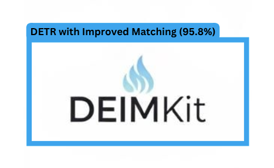

[](https://www.python.org/)
[](https://pixi.sh)
[](https://github.com/prefix-dev/pgsql-search/blob/main/LICENSE)


<div align="center">


<p>DEIMKit is a Python package that provides a wrapper for <a href="https://github.com/ShihuaHuang95/DEIM">DEIM: DETR with Improved Matching for Fast Convergence</a>. Check out the original repo for more details.</p>
</div>

## Why DEIMKit?

- Python instead of config files.
- Easy to install and use on any platform.
- Simple Python interface.

## Supported Features

- [x] Inference
- [x] Training
- [ ] Export

## Installation

### Using pip

```bash
pip install git+https://github.com/dnth/DEIM.git
```

Or install the package from the local directory in editable mode

```bash
git clone https://github.com/dnth/DEIM.git
cd DEIM
pip install -e .
```

### Using Pixi

> [!TIP] 
> I recommend using [Pixi](https://pixi.sh) to run this package. Pixi makes it easy to install the right version of Python and the dependencies to run this package.

Install pixi

```bash
curl -fsSL https://pixi.sh/install.sh | bash
```

Navigate into the base directory of this repo and run 

```bash
git clone https://github.com/dnth/DEIM.git
cd DEIM
pixi install 
```
With that, you've got a working Python environment with all the dependencies installed. This also installs DEIMKit in editable mode for development.

### Using uv

```bash
uv venv --python 3.11
uv pip install -e . 
```

## Usage

List models supported by DEIMKit

```python
from deimkit import list_models

list_models()
```

```
['deim_hgnetv2_n',
 'deim_hgnetv2_s',
 'deim_hgnetv2_m',
 'deim_hgnetv2_l',
 'deim_hgnetv2_x']
```

Load a pretrained model by the original authors

```python
from deimkit import load_model

model = load_model("deim_hgnetv2_x", class_names=coco_classes)
```

Run inference

```python
result = model.predict(image_path, visualize=True)
```

```python
result["visualization"]
```


See the [demo notebook](nbs/pretrained-model-inference.ipynb) for more details.

Training a model

```python
from deimkit import Trainer, Config, configure_dataset

conf = Config.from_model_name("deim_hgnetv2_s")

conf = configure_dataset(
    config=conf,
    image_size=[640, 640],
    train_ann_file="dataset/PCB Holes.v4i.coco/train/_annotations.coco.json",
    train_img_folder="dataset/PCB Holes.v4i.coco/train",
    val_ann_file="dataset/PCB Holes.v4i.coco/valid/_annotations.coco.json",
    val_img_folder="dataset/PCB Holes.v4i.coco/valid",
    train_batch_size=16,
    val_batch_size=16,
    num_classes=2,
    remap_mscoco=False,
    output_dir="./outputs/deim_hgnetv2_s_pcb",
)

trainer = Trainer(conf)
trainer.fit(
    epochs=100,        # Total number of epochs to train
    flat_epoch=50,     # Starting epoch to train with fixed learning rate
    no_aug_epoch=3,    # Ending epoch to train without data augmentation
    warmup_iter=50,    # Number of steps for learning rate warmup
    ema_warmups=50     # Number of warmup steps for EMA
)
```

Monitor training progress

```bash
tensorboard --logdir ./outputs/deim_hgnetv2_s_pcb
```


> [!NOTE]
> If you have a trained custom model you can also load it using the `load_model` function in the same way. Read more in the [custom model inference](nbs/custom-model-inference.ipynb) section.
