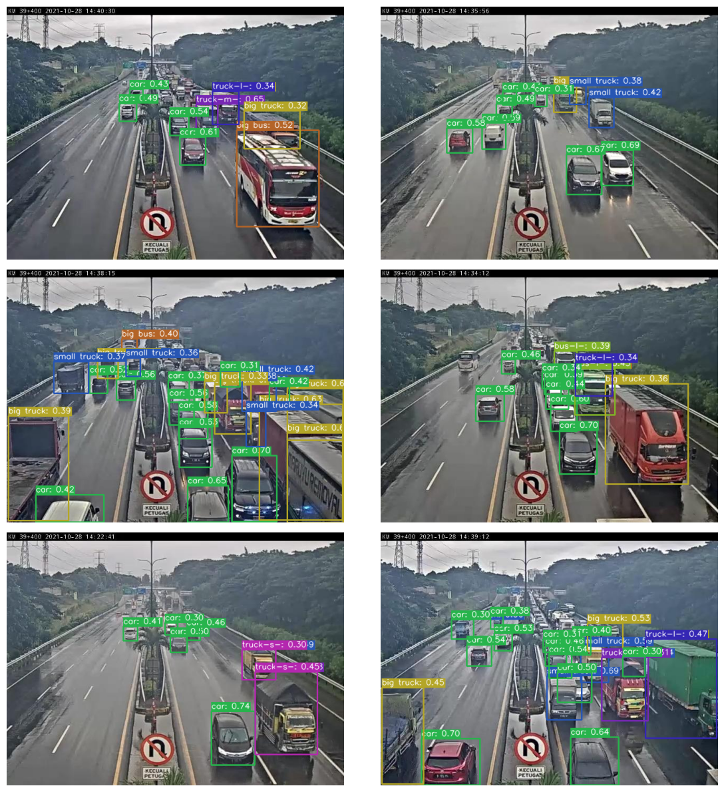
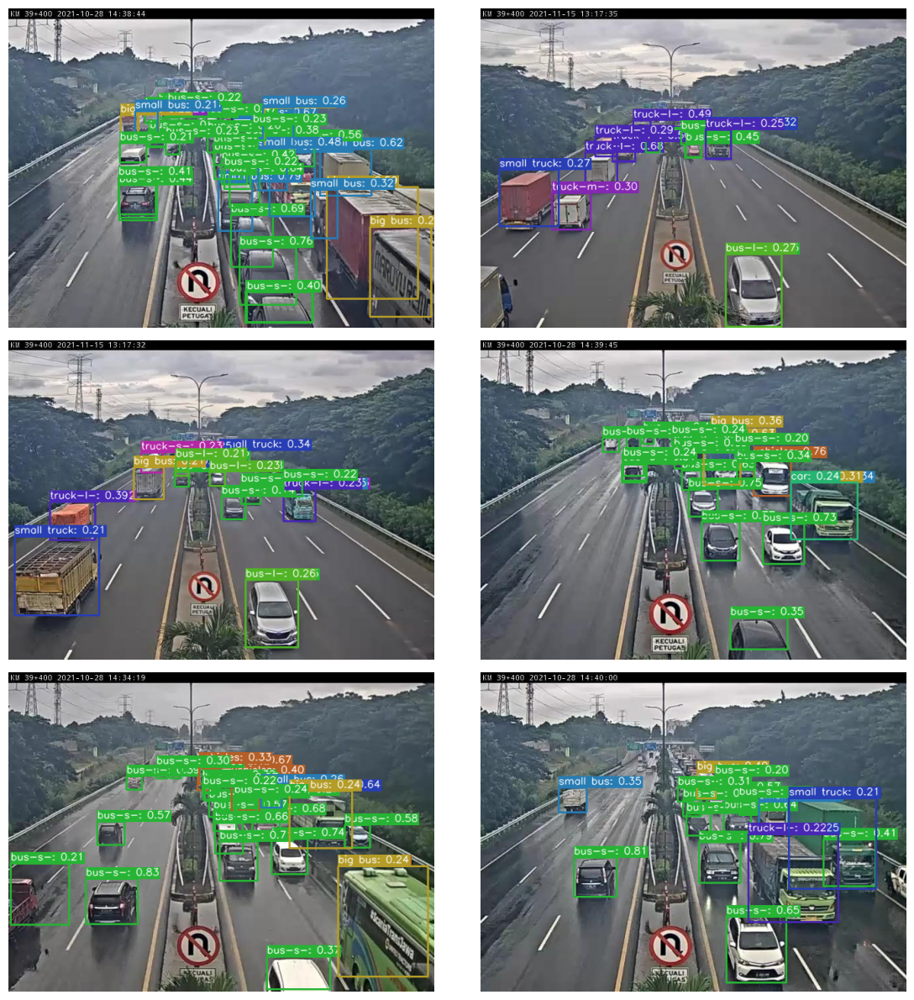
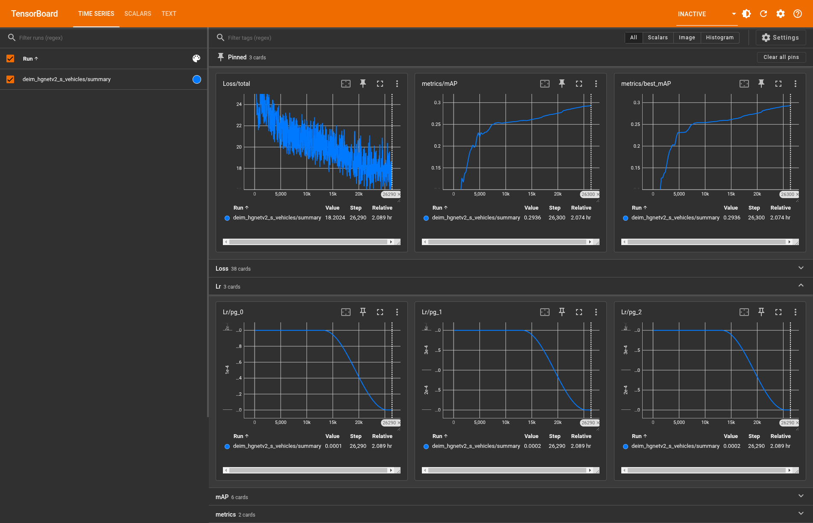
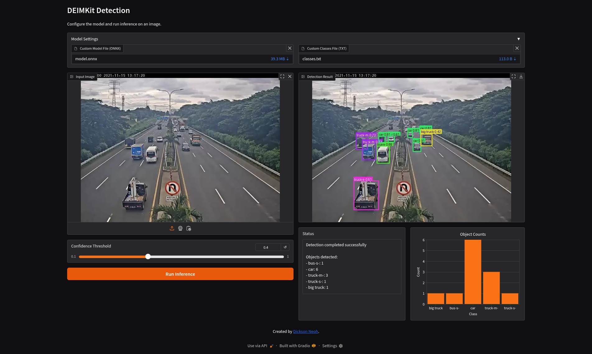

[](https://www.python.org/)
[](https://github.com/prefix-dev/pgsql-search/blob/main/LICENSE)
[](https://pixi.sh)


<div align="center">


<p>DEIMKit is a Python package that provides a wrapper for <a href="https://github.com/ShihuaHuang95/DEIM">DEIM: DETR with Improved Matching for Fast Convergence</a>. Check out the original repo for more details.</p>
</div>

## Why DEIMKit?

- Python instead of config files - Configure your model and dataset in a Python script instead of multiple config files.
- Easy to install and use on any platform - One liner installation. I've only tested on Linux, but it should work on any platform.
- Simple Python interface - Load a model, make predictions, train a model, all in a few lines of code.

## Supported Features

- [x] Inference
- [x] Training
- [x] Export

## Installation

### Using pip

```bash
pip install git+https://github.com/dnth/DEIM.git
```

Or install the package from the local directory in editable mode

```bash
git clone https://github.com/dnth/DEIM.git
cd DEIM
pip install -e .
```

### Using Pixi

> [!TIP] 
> I recommend using [Pixi](https://pixi.sh) to run this package. Pixi makes it easy to install the right version of Python and the dependencies to run this package.

Install pixi

```bash
curl -fsSL https://pixi.sh/install.sh | bash
```

Navigate into the base directory of this repo and run 

```bash
git clone https://github.com/dnth/DEIM.git
cd DEIM
pixi install 
```
With that, you've got a working Python environment with all the dependencies installed. This also installs DEIMKit in editable mode for development.

### Using uv

```bash
uv venv --python 3.11
uv pip install -e . 
```

## Usage

List models supported by DEIMKit

```python
from deimkit import list_models

list_models()
```

```
['deim_hgnetv2_n',
 'deim_hgnetv2_s',
 'deim_hgnetv2_m',
 'deim_hgnetv2_l',
 'deim_hgnetv2_x']
```

### Inference

Load a pretrained model by the original authors

```python
from deimkit import load_model

coco_classes = ["aeroplane", ... "zebra"]
model = load_model("deim_hgnetv2_x", class_names=coco_classes)
```

Load a custom trained model

```python
model = load_model(
    "deim_hgnetv2_s", 
    checkpoint="deim_hgnetv2_s_coco_cells/best.pth",
    class_names=["cell", "platelet", "red_blood_cell", "white_blood_cell"],
    image_size=(320 , 320)
)
```

Run inference on an image

```python
result = model.predict(image_path, visualize=True)
```

Access the visualization

```python
result.visualization
```


You can also run batch inference

```python
results = model.predict_batch(image_paths, visualize=True, batch_size=8)
```

Here are some sample results I got by training on customs datasets.

Vehicles Dataset


RBC Cells Dataset



See the [demo notebook on using pretrained models](nbs/pretrained-model-inference.ipynb) and [custom model inference](nbs/custom-model-inference.ipynb) for more details.

### Training

DEIMKit provides a simple interface for training your own models.

To start, configure the dataset. Specify the model, the dataset path, batch size, etc.

```python
from deimkit import Trainer, Config, configure_dataset

conf = Config.from_model_name("deim_hgnetv2_s")

conf = configure_dataset(
    config=conf,
    image_size=[640, 640],
    train_ann_file="dataset/PCB Holes.v4i.coco/train/_annotations.coco.json",
    train_img_folder="dataset/PCB Holes.v4i.coco/train",
    val_ann_file="dataset/PCB Holes.v4i.coco/valid/_annotations.coco.json",
    val_img_folder="dataset/PCB Holes.v4i.coco/valid",
    train_batch_size=16,
    val_batch_size=16,
    num_classes=2,
    output_dir="./outputs/deim_hgnetv2_s_pcb",
)

trainer = Trainer(conf)
trainer.fit(epochs=100)
```

> [!CAUTION]
> Your dataset should be in COCO format. The class index should **start from 0**. Refer to the structure of a sample dataset exported from [Roboflow](https://universe.roboflow.com/rf-projects/pcb-holes/dataset/4). From my tests this works for DEIMKit.
>
> The `num_classes` should be the number of classes in your dataset + 1 for the background class.

Monitor training progress

```bash
tensorboard --logdir ./outputs/deim_hgnetv2_s_pcb
```

Navigate to the http://localhost:6006/ in your browser to view the training progress.



### Export

```python
from deimkit.exporter import Exporter
from deimkit.config import Config

config = Config("config.yml")
exporter = Exporter(config)

output_path = exporter.to_onnx(
    checkpoint_path="model.pth",
    output_path="model.onnx"
)
```

### Gradio App

```bash
python scripts/gradio_demo.py
```

### Live Inference
Run live inference on a video, image or webcam using ONNXRuntime.

For video inference, the output video will be saved as `onnx_result.mp4` in the current directory.

```bash
python scripts/live_inference.py 
    --onnx model.onnx           # Path to the ONNX model file
    --input video.mp4           # Path to the input video file
    --class-names classes.txt   # Path to the classes file with each name on a new row
    --input-size 320            # Input size for the model
```


https://github.com/user-attachments/assets/714cfbee-d134-479b-869e-81c01e22ce6a


For webcam inference, the output video will be saved as `onnx_result.mp4` in the current directory.

```bash
python scripts/live_inference.py 
    --onnx model.onnx           # Path to the ONNX model file
    --webcam                    # Use webcam as input source
    --class-names classes.txt   # Path to the classes file
    --input-size 320            # Input size for the model
```

For image inference, the output image will be saved as `onnx_result.jpg` in the current directory.

```bash
python scripts/live_inference.py 
    --onnx model.onnx           # Path to the ONNX model file
    --input image.jpg           # Path to the input image file
    --class-names classes.txt   # Path to the classes file
    --input-size 320            # Input size for the model
```



## Disclaimer
I'm not affiliated with the original DEIM authors. I just found the model interesting and wanted to try it out. The changes made here are of my own. Please cite and star the original repo if you find this useful.
