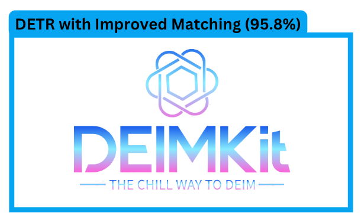

[](https://www.python.org/)
[](https://pixi.sh)
[](https://github.com/prefix-dev/pgsql-search/blob/main/LICENSE)


<div align="center">


<h4>DEIMKit is a Python package that provides a wrapper for <a href="https://github.com/ShihuaHuang95/DEIM">DEIM: DETR with Improved Matching for Fast Convergence</a>. Check out the original repo for more details.</h4>
</div>

## Why DEIMKit?

- Python instead of config files.
- Easy to install and use on any platform.
- Simple Python interface.

## Supported Features

- [x] Inference
- [ ] Training
- [ ] Export

## Installation
Using pip

```bash
pip install git+https://github.com/dnth/DEIM.git
```

> [!TIP] 
> I recommend using [pixi](https://pixi.sh) to run this package. Pixi makes it easy to install the right version of Python and the dependencies to run this package.

Install pixi

```bash
curl -fsSL https://pixi.sh/install.sh | bash
```

## Usage

List models supported by DEIMKit

```python
from deimkit import list_models

list_models()
```

```
['deim_hgnetv2_n',
 'deim_hgnetv2_s',
 'deim_hgnetv2_m',
 'deim_hgnetv2_l',
 'deim_hgnetv2_x']
```

Load a pretrained model by the original authors

```python
from deimkit import load_model

model = load_model("deim_hgnetv2_x", class_names=coco_classes)
```

Run inference

```python
result = model.predict(image_path, visualize=True)
```

```python
result["visualization"]
```


See the [demo notebook](nbs/pretrained-model-inference.ipynb) for more details.

> [!NOTE]
> If you have a trained custom model you can also load it using the `load_model` function in the same way. Read more in the [custom model inference](nbs/custom-model-inference.ipynb) section.
